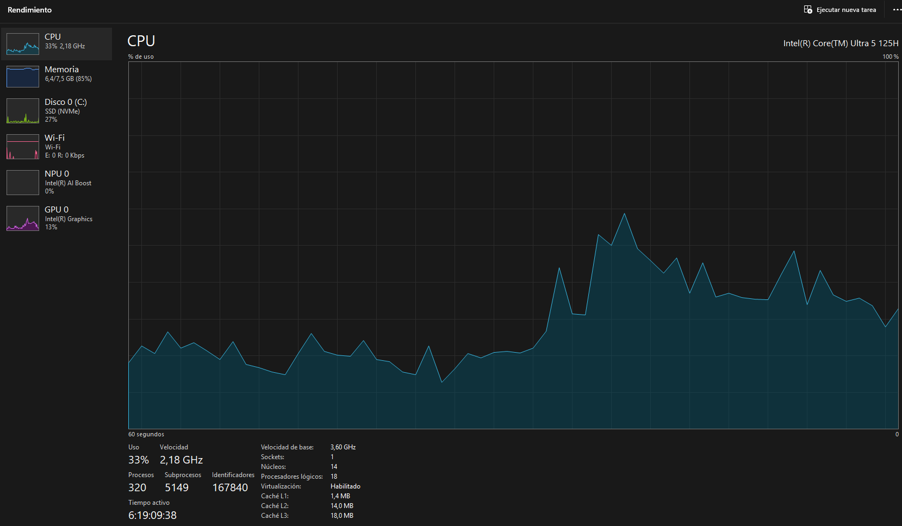
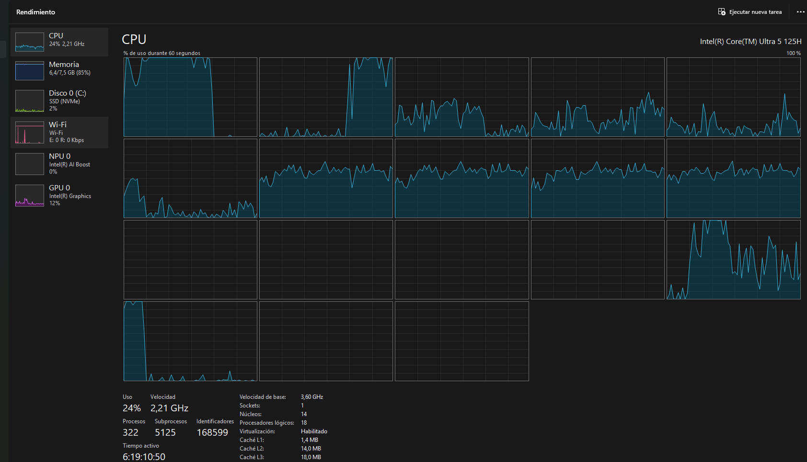
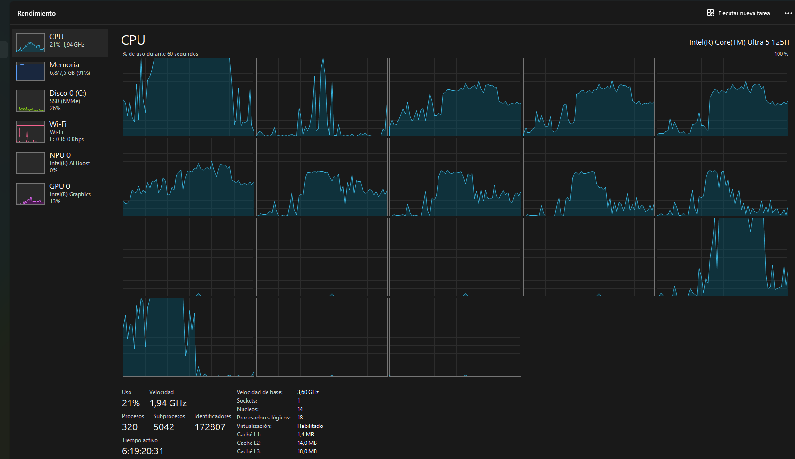
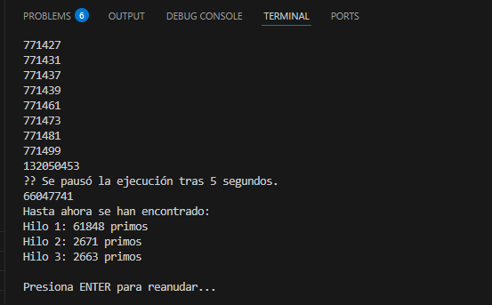
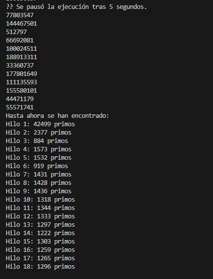

# Laboratorio – Concurrencia y Sincronización en Java
## Descripción

Este laboratorio tiene como objetivo practicar los conceptos de concurrencia, sincronización y coordinación de hilos en Java mediante dos ejercicios principales:

1. Primos Concurrentes:

- Implementación de un programa que busca números primos dentro de un rango definido.
- Inicialmente se ejecuta con un solo hilo, y posteriormente se modifica para usar tres hilos que dividen el trabajo en intervalos más pequeños.
- Se observa cómo el uso de múltiples hilos permite aprovechar mejor los núcleos del procesador.

2. Carrera de Galgos (Simulación Gráfica):

- Simulación de una carrera de perros galgos donde cada galgo es representado por un hilo independiente.
- Todos los hilos comparten un objeto RegistroLlegada que lleva el control de las posiciones de llegada.
- Se identifican y corrigen problemas de condiciones de carrera y de sincronización en el registro de posiciones.
- Se implementa la funcionalidad de pausa y continuar la carrera utilizando los mecanismos de sincronización (wait, notifyAll, join).

### Tecnologías utilizadas

* Lenguaje: Java 8+
* Librerías estándar de java.util.concurrent
* Interfaz gráfica con Swing

### Ejecución
Parte I – Primos Concurrentes

- Ir a la carpeta parte1.
- Compilar y ejecutar la clase principal del paquete edu.eci.arsw.primefinder.
    * mvn clean compile
    * mvn exec:java    

Parte II – Carrera de Galgos

- Ir a la carpeta parte2.
- Compilar y ejecutar MainCanodromo.
    * mvn clean compile
    * mvn exec:java   

# Solución
### Parte 1 
**Punto 1**
Inicialmente el programa ejecuta la búsqueda de primos utilizando **un solo hilo** (`PrimeFinderThread`) en el rango `0 – 200.000.000`.

- En el Administrador de Tareas de Windows se observa que, aunque la CPU tiene **14 núcleos físicos y 18 procesadores lógicos**, el programa solo aprovecha **un hilo de ejecución** para la búsqueda.
- En la vista de CPU por **núcleos lógicos**, se aprecia que la carga de trabajo se concentra principalmente en **un núcleo**, mientras los demás permanecen con baja actividad.
- Es importante mencionar que la JVM y el sistema operativo pueden migrar el hilo entre diferentes núcleos, por lo que en ocasiones se ve actividad ligera en más de un recuadro. Sin embargo, **no hay paralelismo real**, ya que solo existe un hilo de cómputo en el programa.

**Punto 2**
Al ejecutar el programa y observar el **Administrador de tareas de Windows** en la vista por **núcleos lógicos**, se evidenció que ahora **varios núcleos de CPU presentan carga de forma simultánea**. 

- Hilo 1: [0 – 66.000.000]  
- Hilo 2: [66.000.000 – 132.000.000]  
- Hilo 3: [132.000.000 – 200.000.000] 

Al ejecutar el programa y observar el **Administrador de tareas de Windows** en la vista por **núcleos lógicos**, se evidenció que ahora **varios núcleos de CPU presentan carga de forma simultánea**.  
Esto confirma que el programa aprovecha el paralelismo ofrecido por el procesador, mejorando la distribución del trabajo respecto a la versión de un solo hilo.

**Punto 3**
Al ejecutar el programa y modificar de tal manera que despues de 5 seg se detenga para ver cuantos primos alcanzo a contar cada hilo se obtuvo lo siguiente
- Con 3 hilos

- Con 18 hilos 

### Parte 2
**Taller.**
1. 
- El error de que los resultados (total recorrido y número del galgo ganador) son mostrados antes de que finalice la carrera como tal, se debe En MainCanodromo, dentro de la acción del botón Start.
- El problema es que el winnerDialog(...) se ejecuta antes de que los hilos terminen, porque start() arranca cada galgo en paralelo, y el código sigue ejecutándose sin esperar
- La solucion es usar join(), La idea es que el hilo que lanza los galgos espere a que todos los galgos terminen antes de mostrar el resultado.
Para eso se usa join() en cada galgo.
2. Despues de correr varias veces, se muestra una inconsistencia cuando dos galgos llegan de 1, haciendo que los dos tengan el numero 1 (RegistroLlegada):
- Se corrigue este error en la clase Galgo.corra(), debido a que actualmente realiza lo siguiente:
    * Varios galgos pueden leer el mismo valor de ultimaPosicionAlcanzada al mismo tiempo, eso haría que dos galgos se registren en la misma posición o incluso dos se marquen como ganadores.
3.  La Solucion es crear método sincronizado en RegistroLlegada que encapsule toda la lógica de llegada (posición + posible ganador), viendose asi lo que se implemento
    * synchronized en RegistroLlegada → garantiza que no haya inconsistencias en posiciones y ganador.
4. Solucion:
    *  Crear un monitor de pausa → una clase auxiliar que maneje pause(), resume() y waitIfPaused().
    *  galgos, en su bucle de carrera, consultan ese monitor y se detienen si está en pausa.
    *  botones llaman a pause() o resume() del monitor.
    -  Funciona de la siguiente manera:
    *  Cada galgo, en su bucle, llama a monitor.esperarSiPausado() → se queda esperando si la carrera está en pausa.
    *  Stop → monitor.pausar() hace que los galgos se queden en wait().
    *  Continue → monitor.reanudar() hace notifyAll() y todos los galgos despiertan.

### Autor   
    Juan David Rodriguez